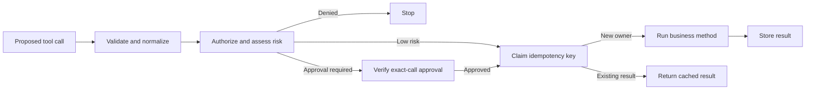

# AgentPermit4j

**Approve the exact action. Execute through policy. Keep retries from repeating it.**

[](https://github.com/mat973252-coder/agent-permit4j/actions/workflows/build.yml)
[](pom.xml)
[](LICENSE)

[English](README.md) · [简体中文](README.zh-CN.md)

AgentPermit4j is a Java library for controlling what AI agents are allowed to **do**. It puts authorization, contextual risk checks, exact-call approval, idempotency, and audit between a proposed tool call and your business code. Spring AI adapters connect that boundary to existing tools.

[Try it locally](#try-it-locally) · [Integrate](#integrate-with-spring-ai) · [Documentation](#documentation) · [Guarantees and limits](#guarantees-and-limits)

## Why AgentPermit4j?

An agent that can look up an order may also be able to refund it. Before the write happens, your application needs answers: who requested it, which tenant owns it, what exactly was approved, and what happens if the response is lost?

AgentPermit4j makes those checks explicit in backend code:

| At the action boundary | What you get |
| --- | --- |
| A tool call changes arguments or tenant after approval | Approval is bound to the complete normalized invocation; the changed call cannot reuse it. |
| A tool's risk depends on its input | Java policies evaluate SQL, HTTP, messaging, or your own resource types at runtime. |
| Multiple callers retry the same operation | A stable key and matching invocation share the stored result through the configured idempotency guard. |
| A reviewer needs to approve a write | Identified review checks application-defined reviewer policy and records the first successful decision. |
| You need to understand a decision | Stable reason codes and append-only audit timelines explain the path without retaining raw arguments or tool output. |

The source checkout also includes an **order-refund recovery example**: a successful payment response is lost, the operation stays `UNKNOWN`, and a read-only reconciliation confirms it without another payment request.

## How it works



Audit events accompany the decision stages. Identity, tenant, environment, approval ID, and idempotency key come from application-controlled context. Model text cannot grant permission. Every external side effect must stay inside the guarded executor.

## Try it locally

You need **JDK 21** and Git. The repository includes Maven Wrapper. The first build downloads dependencies; the demos need no LLM key, Node.js, external database, or payment account.

```bash
git clone https://github.com/mat973252-coder/agent-permit4j.git
cd agent-permit4j
./mvnw -B -ntp -pl agent-permit-playground -am verify
```

On Windows, replace the last command with:

```powershell
.\mvnw.cmd -B -ntp -pl agent-permit-playground -am verify
```

This runs tests and terminal demos using the real decision pipeline, mock external actions, and a local H2 refund ledger. The recovery demo prints:

```text
SCENARIO refund-recovery
  REVIEW approver=reviewer-a selfApproval=DENIED
  RESPONSE status=UNKNOWN payments=1 refundedCents=0
  REBUILT status=UNKNOWN reference=owner-scoped
  RECONCILED status=SUCCEEDED payments=1 paymentRequests=1 refundedCents=2500 retry=same-snapshot
```

`payments=1` and `paymentRequests=1` stay unchanged through reconciliation. See the [complete refund walkthrough](docs/refund-example.md) for the approval, order-version, concurrency, and failure cases.

### Explore the Web Playground

```bash
./mvnw -B -ntp -pl agent-permit-playground -am -DskipTests install
./mvnw -f agent-permit-playground/pom.xml exec:java@run-web
```

On Windows use `.\mvnw.cmd` with the same arguments. Open [localhost:8088](http://127.0.0.1:8088/) to inspect decisions, approve a fixed demo action, retry it, and replay its audit timeline.

The web console uses synthetic scenarios and mock side effects; the refund recovery example runs in the terminal. The server listens only on loopback and has no production approval authentication. [Playground details](docs/demo-website.md).

## Integrate with Spring AI

**Current source version: `0.4.0-SNAPSHOT` · Java 21 · Spring AI 2.0.1 · Spring Boot 4.0.8**

Install this checkout into your local Maven repository:

```bash
./mvnw -B -ntp -DskipTests install
```

Then add the adapter to your application:

```xml
<dependency>
  <groupId>io.github.mat973252</groupId>
  <artifactId>agent-permit-spring-ai</artifactId>
  <version>0.4.0-SNAPSHOT</version>
</dependency>
```

The snapshot is a source-build dependency. A [`v0.2.0` Git tag](https://github.com/mat973252-coder/agent-permit4j/tree/v0.2.0) exists, but these newer APIs are not in that tag. Do not assume either version is available from Maven Central.

### Register existing business methods

Place `@AgentPermit` beside Spring AI's `@Tool` on each public method you expose. Supply your validator, normalizer, authorization and risk policies, approval service, shared idempotency guard, audit sink, and trusted-context resolver:

```java
// Wiring excerpt: all dependencies and tool objects are application-owned.
var dependencies = new GuardedToolMethods.Dependencies(
    validator, normalizer, authorizer, riskEvaluator,
    approvals, resultIdempotencyGuard, auditSink, trustedContextResolver);

var callbacks = GuardedToolMethods.fromAnnotated(dependencies, orderTools);
// Register only these guarded callbacks with your Spring AI client.
```

The factory invokes each method **inside** the execution pipeline. Compile tool classes with `-parameters`; the current mapper accepts flat scalar arguments. Registration is explicit, with no classpath scanning or proxy/interface annotation discovery.

Start with the working [three-tool example](docs/refund-example.md) and its [RefundTools implementation](agent-permit-playground/src/main/java/io/github/mat973252/agentpermit/playground/refund/RefundTools.java). The [configuration reference](docs/integration-reference.md) covers annotation limits, custom denial codes, the lower-level callback API, Spring Boot wiring, and the optional Spring Security bridge. Adding the starter alone does not supply policies or automatically protect existing tools.

## Guarantees and limits

AgentPermit4j protects calls routed through its pipeline. Applications own authentication, reviewer authorization, business invariants, and the external executor; the SDK does not sandbox arbitrary Java code.

| Area | Contract and boundary |
| --- | --- |
| Approval | Binds normalized arguments, principal, resource, tenant, and environment, with expiry. Reviewer roles and self-approval rules are application policy. |
| Idempotency | In-memory guards coordinate within one instance. Redis coordinates across processes, provided records survive. External actions and Redis are not one transaction; there is no unconditional distributed exactly-once guarantee. |
| Redis operations | Owner expiry never transfers execution rights. Records have no TTL or cleanup API; persistence, `noeviction`, lease sizing, sensitive cached output, and the single cluster slot require operational planning. |
| Audit | Stores decision metadata; excludes raw arguments, output, and approval secrets. Replay only reads events. An audit write failure after an external action cannot undo that action. |
| Resource checks | HTTP policies do not resolve DNS; the executor must handle DNS rebinding. Lexical file policies do not resolve symlinks or filesystem races. |
| Refund recovery | `EXECUTED` means the Java method returned; its business status can still be `UNKNOWN` or `FAILED`. Reconciliation belongs to the example, not a generic SDK workflow engine. |

The refund demo rebuilds services over retained H2 and simulator state in one process. It does not prove recovery from a killed JVM or a real payment provider. Unknown operations remain reserved until conclusive evidence arrives; there is no automatic payment retry or timeout release. [Detailed contracts](docs/architecture.md).

## Documentation

| I want to… | Start here |
| --- | --- |
| Integrate three actual tools with approval and recovery | [Order-refund walkthrough](docs/refund-example.md) |
| Consume SDK artifacts in a standalone application | [Three-method adoption example](examples/spring-ai-adoption/README.md) |
| Prepare and verify distributable artifacts | [Candidate and release checks](docs/releasing.md), [Changelog](CHANGELOG.md) |
| Configure Spring AI, Spring Boot, JDBC, or Redis | [Integration reference](docs/integration-reference.md) |
| Understand trust boundaries and dependency direction | [Architecture](docs/architecture.md) |
| Explore the local console | [Playground guide](docs/demo-website.md) |
| See implemented work and acceptance criteria | [Roadmap](TODO.md), [v0.3](docs/iterations/v0.3.md), [v0.4](docs/iterations/v0.4.md) |

## Modules

All artifact names below use the `agent-permit-` prefix. Reusable domain and policy modules stay independent of Spring and storage clients.

| Modules | Responsibility |
| --- | --- |
| `core`, `policy` | Immutable invocation/decision values and Java policy interfaces/evaluators |
| `execution` | Guarded pipelines, business outcome values, and in-memory idempotency |
| `approval`, `audit` | Approval lifecycle, fingerprints, identified review, and safe audit timelines |
| `jdbc`, `redis` | JDBC approval/audit storage and Redis result idempotency |
| `spring-ai` | Guarded callbacks, annotation policy, and explicit method registration |
| `spring-boot-autoconfigure`, `spring-boot-starter` | Explicit callback wiring and optional trusted Spring Security context |
| `playground` | Runnable demonstrations and acceptance scenarios |

## Contributing

Bug reports, integration feedback, and focused pull requests are welcome. Read [CONTRIBUTING.md](CONTRIBUTING.md), then run the repository checks:

```bash
./mvnw -B -ntp verify
```

Windows: `.\mvnw.cmd -B -ntp verify`. The default suite uses deterministic fakes; the [real Redis acceptance suite](docs/integration-reference.md#redis-result-idempotency) is opt-in.

Report reproducible problems through [GitHub Issues](https://github.com/mat973252-coder/agent-permit4j/issues). For vulnerabilities, follow [SECURITY.md](SECURITY.md).

## License

[Apache License 2.0](LICENSE).
