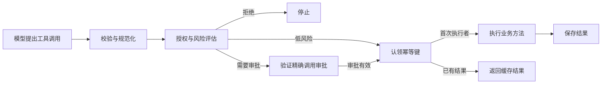

# AgentPermit4j

**审批绑定具体动作，策略守住执行入口，重试复用执行结果。**

[](https://github.com/mat973252-coder/agent-permit4j/actions/workflows/build.yml)
[](pom.xml)
[](LICENSE)

[English](README.md) · [简体中文](README.zh-CN.md)

AgentPermit4j 是一个控制 AI Agent **可以执行哪些动作**的 Java 库。它在模型提出的工具调用与业务代码之间，统一执行授权、动态风险评估、精确调用审批、幂等和审计，并通过 Spring AI 适配器接入已有工具。

[本地体验](#本地体验) · [接入 Spring AI](#接入-spring-ai) · [文档导航](#文档导航) · [保证与边界](#保证与边界)

## 为什么需要 AgentPermit4j？

能查询订单的 Agent，也可能拥有退款工具。真正执行写操作前，后端需要确认：谁发起的、属于哪个租户、审批的到底是什么，以及响应丢失后能否重试。

AgentPermit4j 把这些检查放在明确的后端执行边界上：

| 执行时遇到的问题 | 项目提供的能力 |
| --- | --- |
| 审批后，工具参数或租户被修改 | 审批绑定完整的规范化调用；修改后的调用不能复用原审批。 |
| 同一个工具的风险随输入变化 | Java 策略在运行时评估 SQL、HTTP、消息或自定义资源。 |
| 多个调用方同时重试 | 稳定幂等键与相同调用通过配置的 guard 共享已存储结果。 |
| 写操作需要人工审核 | 身份审批检查应用提供的审批人策略，并保留首次成功审批记录。 |
| 需要解释某次执行或拒绝 | 稳定原因码和只追加审计时间线记录决策路径，不保存原始参数和工具输出。 |

当前源码还提供**订单退款恢复示例**：模拟支付成功但响应丢失，操作保持 `UNKNOWN`，随后只查询并对账，在不再次发起支付的情况下确认结果。

## 执行流程



审计事件随决策阶段记录。身份、租户、环境、审批号和幂等键来自应用控制的可信上下文；模型文字不能授予权限。所有外部副作用都必须放在受保护的 executor 内。

## 本地体验

准备 **JDK 21** 和 Git 即可，仓库自带 Maven Wrapper。首次构建会下载依赖；演示无需 LLM Key、Node.js、外部数据库或支付账号。

```bash
git clone https://github.com/mat973252-coder/agent-permit4j.git
cd agent-permit4j
./mvnw -B -ntp -pl agent-permit-playground -am verify
```

Windows 将最后一条命令替换为：

```powershell
.\mvnw.cmd -B -ntp -pl agent-permit-playground -am verify
```

命令会运行测试与终端演示，使用真实决策管线、模拟外部动作和本地 H2 退款账本。恢复场景输出如下：

```text
SCENARIO refund-recovery
  REVIEW approver=reviewer-a selfApproval=DENIED
  RESPONSE status=UNKNOWN payments=1 refundedCents=0
  REBUILT status=UNKNOWN reference=owner-scoped
  RECONCILED status=SUCCEEDED payments=1 paymentRequests=1 refundedCents=2500 retry=same-snapshot
```

对账后，`payments=1` 和 `paymentRequests=1` 保持不变。审批、订单版本、并发与故障场景见[完整退款示例](docs/refund-example.md)。

### 打开 Web Playground

```bash
./mvnw -B -ntp -pl agent-permit-playground -am -DskipTests install
./mvnw -f agent-permit-playground/pom.xml exec:java@run-web
```

Windows 使用 `.\mvnw.cmd`，其余参数相同。打开 [localhost:8088](http://127.0.0.1:8088/)，查看决策、批准固定演示动作、重复调用，并回放审计时间线。

Web 控制台使用合成场景与 mock 副作用；退款恢复示例在终端运行。服务仅监听 loopback，没有生产审批鉴权。参见 [Playground 说明](docs/demo-website.md)。

## 接入 Spring AI

**正式版本：`0.5.0` · Java 21 · Spring AI 2.0.1 · Spring Boot 4.0.8**

Java 包名与 Maven groupId 已统一为 `io.github.agentpermit4j`。
已有消费方需要更新依赖坐标、import、资源路径并重新编译，详见[迁移说明](CHANGELOG.md#breaking-java-namespace-migration)。

直接在应用中添加 Maven Central 上的适配器依赖：

```xml
<dependency>
  <groupId>io.github.agentpermit4j</groupId>
  <artifactId>agent-permit-spring-ai</artifactId>
  <version>0.5.0</version>
</dependency>
```

0.5.0 已[发布到 Maven Central](https://repo.maven.apache.org/maven2/io/github/agentpermit4j/agent-permit-spring-ai/0.5.0/)，无需先从源码安装。

### 注册已有业务方法

在需要暴露的 public 方法上同时声明 Spring AI 的 `@Tool` 和 `@AgentPermit`。由应用提供校验器、规范化器、授权与风险策略、审批服务、共享幂等 guard、审计 sink 和可信上下文解析器：

```java
// 装配片段：以下依赖与工具对象均由应用提供。
var dependencies = new GuardedToolMethods.Dependencies(
    validator, normalizer, authorizer, riskEvaluator,
    approvals, resultIdempotencyGuard, auditSink, trustedContextResolver);

var callbacks = GuardedToolMethods.fromAnnotated(dependencies, orderTools);
// 只将这些受保护的 callbacks 注册给 Spring AI 客户端。
```

工厂在执行管线**内部**调用业务方法。工具类需使用 `-parameters` 编译；当前参数映射支持扁平标量。注册对象由应用显式指定，不扫描 classpath，也不提供代理或接口注解发现。

从可运行的[三个业务工具示例](docs/refund-example.md)及 [RefundTools 实现](agent-permit-playground/src/main/java/io/github/agentpermit4j/playground/refund/RefundTools.java)开始接入。[配置参考](docs/integration-reference.zh-CN.md)包含注解限制、自定义拒绝码、底层 callback API、Spring Boot 装配和可选的 Spring Security 桥接。仅添加 starter 不会自动提供策略或保护已有工具。

## 保证与边界

AgentPermit4j 保护经过管线的调用。应用负责身份认证、审批人授权、业务约束和实际执行器；SDK 不沙箱化任意 Java 代码。

| 范围 | 契约与限制 |
| --- | --- |
| 审批 | 绑定规范化参数、主体、资源、租户和环境，并检查过期时间。审批角色与禁止自审等规则由应用定义。 |
| 幂等 | 内存 guard 在单实例内协调；Redis 在记录完整保留的前提下跨进程协调。外部动作与 Redis 不在同一事务中，不提供无条件的分布式 exactly-once 保证。 |
| Redis 运维 | owner 过期不会转交执行权。记录没有 TTL 或清理 API；需规划持久化、`noeviction`、租约时长、敏感结果缓存与单 cluster slot 的扩展限制。 |
| 审计 | 记录决策元数据，排除原始参数、输出和审批秘密；回放只读事件。外部动作完成后的审计写入失败无法撤销该动作。 |
| 资源检查 | HTTP 策略不解析 DNS，执行器仍需防止 DNS rebinding；词法文件策略不解析符号链接或处理文件系统竞态。 |
| 退款恢复 | `EXECUTED` 仅表示 Java 方法返回，其业务状态仍可能为 `UNKNOWN` 或 `FAILED`。对账由示例实现，SDK 尚未提供通用工作流引擎。 |

退款演示在同一进程内保留 H2 和模拟支付状态后重建服务，不证明真实 JVM 被终止或实际支付服务下的恢复能力。未知操作保持占用，直到获得确定证据；不自动重试支付，也不超时释放。参见[完整安全契约](docs/architecture.md)。

## 文档导航

| 我想要…… | 从这里开始 |
| --- | --- |
| 接入三个真实方法，跑通审批与恢复 | [订单退款示例](docs/refund-example.md) |
| 配置 Spring AI、Spring Boot、JDBC 或 Redis | [接入配置参考](docs/integration-reference.zh-CN.md) |
| 在独立工程中消费 SDK 制品 | [三个业务方法接入示例](examples/spring-ai-adoption/README.md) |
| 验证候选制品与准备发布 | [候选构建和发布检查](docs/releasing.md)、[版本记录](CHANGELOG.md) |
| 理解信任边界和依赖方向 | [架构说明](docs/architecture.md) |
| 体验本地控制台 | [Playground 指南](docs/demo-website.md) |
| 查看已实现内容与验收标准 | [路线图](TODO.md)、[v0.3](docs/iterations/v0.3.md)、[v0.4](docs/iterations/v0.4.md) |

## 模块

下列 artifact 均带 `agent-permit-` 前缀。可复用领域与策略模块不依赖 Spring 或存储客户端。

| 模块 | 职责 |
| --- | --- |
| `core`、`policy` | 不可变调用与决策类型，Java 策略接口和 evaluator |
| `execution` | 受保护执行管线、业务结果值与内存幂等 |
| `approval`、`audit` | 审批生命周期、指纹、身份审批与安全审计时间线 |
| `jdbc`、`redis` | JDBC 审批／审计存储与 Redis 结果幂等 |
| `spring-ai` | 受保护 callback、注解策略与显式方法注册 |
| `spring-boot-autoconfigure`、`spring-boot-starter` | 显式 callback 装配与可选 Spring Security 可信上下文 |
| `playground` | 可运行演示与验收场景 |

## 参与贡献

欢迎缺陷报告、实际接入反馈和聚焦的 PR。先阅读 [CONTRIBUTING.md](CONTRIBUTING.md)，再运行仓库检查：

```bash
./mvnw -B -ntp verify
```

Windows：`.\mvnw.cmd -B -ntp verify`。默认测试使用确定性 fake；[真实 Redis 验收](docs/integration-reference.zh-CN.md#redis-结果幂等)需显式启用。

可复现的问题请提交到 [GitHub Issues](https://github.com/mat973252-coder/agent-permit4j/issues)；安全漏洞请按 [SECURITY.md](SECURITY.md) 报告。

## 许可证

[Apache License 2.0](LICENSE)。
